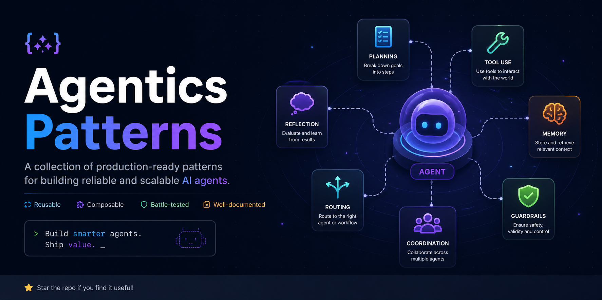

# Agentics Patterns

Runnable pattern examples and Markdown agent definitions for building agent harnesses.

The patterns live under `patterns/`, and each pattern carries its reusable agent definitions in an `agents/` subfolder.

## Why This Exists

Most agent projects start with a vague prompt and a pile of tools. That works for demos, but it breaks down when the work has policy gates, handoffs, verification, memory, cost limits, or human approvals. This repo turns those recurring coordination problems into concrete patterns.

Each pattern describes:

- the agents involved
- the order of work
- the policy gates that must be enforced
- the input shape a harness should accept
- the output artifact a real system should produce
- a runnable example that validates the expected artifact shape

The value is not just the individual prompts. The useful part is the operating model: who owns a decision, who verifies it, what evidence is required, and where the workflow must stop for safety or human approval.

## What You Can Build With It

Use this repo as a starting catalog when designing a production agent harness. Instead of inventing roles from scratch, pick the pattern closest to your workflow and adapt the agents, gates, and output contract.

Examples:

- A support team can start from `support-resolution` to triage tickets, retrieve cited knowledge-base answers, draft customer replies, and escalate low-confidence cases.
- An engineering team can start from `coding-senior-engineering-pod` or `test-first-coding-pod` to split planning, implementation, review, and tests across separate agents.
- An operations team can start from `devops-incident-response` to keep alert triage, runbook execution, escalation, and postmortems in separate lanes.
- A research workflow can start from `research-evidence-dossier` or `evidence-first-research` to require source grading, contradiction checks, and citation verification before synthesis.
- A governance layer can start from `default-deny-tool-broker`, `human-approval-gate`, and `receipt-led-governance` to make risky tool calls explicit, approved, and auditable.

## Real-World Scenario

Consider an enterprise customer support workflow for a SaaS product. A customer reports that SSO stopped working after an identity-provider certificate rotation.

Without a pattern, a single agent might guess from memory, write an answer, and maybe miss an escalation condition. With this repo, you can build the workflow from the `support-resolution` pattern:

1. `Triager` classifies the ticket by urgency, customer tier, and sentiment.
2. `KB Searcher` retrieves only cited product and policy articles.
3. `Responder` drafts a customer-facing reply grounded in those articles.
4. `Escalator` hands the issue to a human when confidence, severity, or authority is insufficient.
5. `Memory Updater` stores only durable, non-sensitive learning for future tickets.

Then you can strengthen it with cross-cutting patterns:

- Add `default-deny-tool-broker` if agents need access to ticketing, shell, CRM, or network tools.
- Add `human-approval-gate` before refunds, credits, account changes, or public commitments.
- Add `receipt-led-governance` so material actions leave an audit trail.
- Add `memory-distillation` so the system learns from repeated incidents without storing raw sensitive history.

That gives you a harness design that is easier to test, safer to run, and clearer to audit than a single all-purpose support bot.

## How To Use The Repo

Start with `patterns/README.md` to find a pattern. Each pattern directory contains:

- `flow.json` for the machine-readable workflow contract
- `input.json` for a concrete scenario
- `expected-output.json` for the output artifact shape
- `README.md` for a human-readable walkthrough
- `agents/` for the Markdown agent definitions used by that pattern

Then open the pattern's `agents/` folder (all of them are indexed in `patterns/AGENTS.md`) and copy the matching Markdown agent definitions into your target harness or host-specific agent directory. The agent files are pattern-scoped so repeated names such as `Verifier`, `Strategist`, and `Responder` can have different responsibilities in different workflows.

For a quick contract check, run an example:

```bash
cd patterns
python run_example.py support-resolution --check
```

## Repository Layout

- `patterns/` - runnable-shape pattern examples and flow contracts, each with an `agents/` subfolder of Markdown agent definitions (indexed in `patterns/AGENTS.md`)
- `tests/` - catalog and example contract tests
- `tools/` - scripts used to generate and maintain the examples

## Credit

Inspired by [ruvnet/agent-harness-generator](https://github.com/ruvnet/agent-harness-generator).
